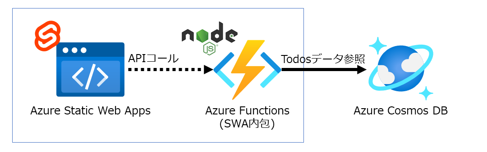

# svelte-on-static-web-apps
This Svelte application is an example for running on Azure Static Web Apps and using APIs.  
https://aadojo.alterbooth.com/entry/2021/12/16/000000  



## Requirement
- Azure Functions Core Tools
  - https://github.com/Azure/azure-functions-core-tools
- Azure Static Web Apps CLI
  - https://github.com/Azure/static-web-apps-cli
- Azure Cosmos DB Emulator
  - https://docs.microsoft.com/ja-jp/azure/cosmos-db/local-emulator

## Installation
### As Azure Static Web Apps

```bash
npm install
```

### As Azure Functions

```bash
cd api
npm install
```

### Create `/api/local.settings.json`

```json
{
  "IsEncrypted": false,
  "Values": {
    "AzureWebJobsStorage": "UseDevelopmentStorage=true",
    "FUNCTIONS_WORKER_RUNTIME": "node",
    "NODE_TLS_REJECT_UNAUTHORIZED": "0",
    "CosmosDBConnection": "AccountEndpoint=https://localhost:8081/;AccountKey=C2y6yDjf5/R+ob0N8A7Cgv30VRDJIWEHLM+4QDU5DE2nQ9nDuVTqobD4b8mGGyPMbIZnqyMsEcaGQy67XIw/Jw=="
  }
}
```

### Create Azure Cosmos DB Database and Container
- Database id: `SvelteTest`
- Container id: `Todos`
- Pertition key: `pk`

## Usage
### As Azure Static Web Apps

```bash
npm run build
swa start public --api-location api
```

### As Azure Functions

```bash
cd api
func start
```
